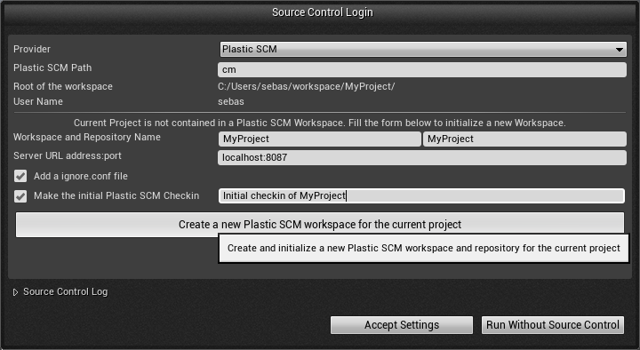
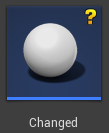
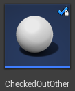
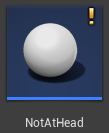

Unreal Engine 4 Plastic SCM Source Control Plugin
-------------------------------------------------

[](https://github.com/SRombauts/UE4PlasticPlugin/releases)
[](https://gitter.im/UE4PlasticPlugin)

This is the **official [Plastic SCM](https://www.plasticscm.com/) Source Control Plugin for Unreal Engine 4** (UE 4.11 to 4.21)

It is not intended to replace [Plastic SCM GUI](https://www.plasticscm.com/documentation/gui/plastic-scm-version-control-gui-guide.shtml) or [command line interface "cm"](https://www.plasticscm.com/documentation/cli/plastic-scm-version-control-cli-guide.shtml).
It is a complementary tool improving efficiency in your daily workflow with assets in Editor.

It automates tracking of assets, brings common SCM tasks inside the Editor, and provides visual diffing of Blueprints. It also helps importing an existing UE4 Project into source control, with appropriate *ignore.conf* file.
Since UE4 does not manage C++ source code, but only assets, the plugin is especially useful for GDs and artists.

Source Control Login window, to create a new workspace/a new repository:


Source Control status tooltip, when hovering the Source Control icon in toolbar:


Source Control top Menu, extended with commands specific to Plastic SCM:


Submit Files to Source Control window, to check-in assets:


File History window, to see the changelog of an asset:


Visual Diffing of different revision of a Blueprint:


Status Icons:








### References

- [Source Control user interface](https://docs.unrealengine.com/latest/INT/Engine/UI/SourceControl/)
- [Source Control Inside Unreal Editor](https://docs.unrealengine.com/latest/INT/Engine/Basics/SourceControl/InEditor/)

- [Diffing Unreal Assets](https://www.unrealengine.com/blog/diffing-unreal-assets)
- [Diffing Blueprints (Video)](https://www.unrealengine.com/blog/diffing-blueprints)

### Quick setup from binary release

1. Download the [latest binary release UE4PlasticPlugin-x.x.x.zip](https://github.com/SRombauts/UE4PlasticPlugin/releases) targeting your UE4 version.
2. Either:
    1. Unzip the content of the ZIP in the root of the Unreal Engine 4.x project folder.
       That should create a "Plugins/" folder into your project.
       This is the way to go to use Plastic SCM only on a specific project.
    2. Unzip the content of the ZIP in the Engine/ directory of UE4.x directly for all your projects
       (for instance "C:\Program Files\Epic Games\4.18\Engine\")
       That should create a "UE4PlasticPlugin" folder into the "Plugins/" subdirectory.
       This is the way to enable Plastic SCM for all Unreal Engine projects.
3. Then, launch Unreal Engine 4.x, click on the Source Control icon "Connect to Source", select "Plastic SCM".

### How to build from sources

If your project is already a C++ project, you only have to re-generate Visual Studio project files (step 4 bellow) and the plugin will get rebuild the next time you compile your project.

Else, if you want to rebuild the plugin for a Blueprint project:

0. You need Visual Studio 2015 or 2017 with C++ language support (free Community Edition is fine).
1. Launch the Unreal Engine 4 Editor, create a new C++ **Basic Code** Project (No Starter Content), for instance UE4PlasticSCM. This should launch Visual Studio, build the game project, and open it into the Editor.
2. Close the Editor, then using the file explorer, create a new **Plugins** directory at the root of your project.
3. Clone the source code of the plugin into this _Plugins_ directory (for instance _Plugins\UE4PlasticPlugin_).
4. Right-click on your project's **.uproject** file, **Generate Visual Studio project files**.
5. In Visual Studio, **Reload All** and **Build Solution** in **Development Editor** mode. That's it, the plugin is built (resulting dlls are located in _Plugins\UE4PlasticPlugin\Binaries\Win64_).

To release the plugin, zip the _Plugins_ folder. But before that, remove the _Intermediate_, _Screenshots_ and _.git_ folders, and also the big *.pdb files in _Plugins\UE4PlasticPlugin\Binaries\Win64_.

### Status

#### Version 1.4.2 2019/01/22 for UE4.21:
- manage connection to the server
- show current branch name and CL in status text
- display status icons to show controlled/checked-out/added/deleted/private/changed/ignored files
- display locked files, and by who
- add, duplicate a file
- move/rename a file or a folder
- revert modifications of a file (works best with the "Content Hot-Reload" option since UE4.15)
- check-in a set of files with a multi-line UTF-8 comment
- migrate (copy) an asset between two projects if both are using Plastic SCM
- delete file (but no way to check-in them, see known issues bellow)
- update workspace to latest head (Sync command)
- show history of a file
- visual diff of a blueprint against depot or between previous versions of a file
- initialize a new workspace to manage your UE4 Game Project.
- make the initial commit with a custom message
- create an appropriate ignore.conf file as part of initialization
- also permit late creation of the ignore.conf file
- show conflicted files and 3-way visual diff
- solve a merge conflict on a blueprint
- top-menu global "Sync" instead of on folder's context menu
- top-menu global "undo unchanged" and "undo all checkout"
- [Partial Checkin (like Gluon, for artists)](http://blog.plasticscm.com/2015/03/plastic-gluon-is-out-version-control.html)
- Plastic Cloud is fully supported
- xlinks sub-repositories (for Plugins for instance)
- Windows only

#### Feature Requests
- Mac OS X Support
- add a setting to pass the --update option to "checkin"
- add a setting to tell UE if Plastic SCM is configured to use "read-only flags" like Perforce
- add a "clean directory" or "check-in deleted files"
- add dedicated icon for Changed files
- add dedicated icon for Conflicted files
- add dedicated icon for Replaced/Merged files

#### Known issues
- Revert "Unchanged only" does nothing because Plastic SCM cli lacks a "checked-out but unchanged" status.
- Merge conflict from cherry-pick or from range-merge cannot be solved by the plugin: use the Plastic SCM GUI
- Merge Conflict: "Accept Target" crash the UE4.11 Editor (same with Git Plugin)
- #18 Error messages with accents are not correctly handled/displayed (for instance connection error in French)
- the Editor does not handle visual diff for renamed/moved assets
- History does not show which revision is the current/checkout one
- Editing an asset that is "Changed" but not checked-out pop up a "Files need check-out!" (UnrealEdSrv.cpp) that does nothing when clicked!
- the Editor does not show folder status and is not able to manage them
- Branch and Merge are not in the current Editor workflow

#### Features reserved for internal use by Epic Games with Perforce only
- tags: get labels (used for crash when the full Engine is under Plastic SCM)
- annotate: blame (used for crash when the full Engine is under Plastic SCM)

### Locking UE4 assets
Binary assets should be locked for exclusive access to avoid merge conflicts.

To lock all assets on the whole `Content` directory, you need to put a `lock.conf` in your server directory (for instance `C:\Program Files\PlasticSCM5\server`) with this content:

```
rep:default lockserver:mainsvr:8084
\Content
```

For instance:

```
rep:UE4PlasticPluginDev lockserver:localhost:8087
\Content
```

### Support

You can always ask questions in [Unreal Engine forums](https://forums.unrealengine.com/showthread.php?108688-Plastic-SCM-Source-Control-Provider/page2).

#### Report an issue

To report an issue, please use the [Github issue-tracker](https://github.com/SRombauts/UE4PlasticPlugin/issues?q=is%3Aissue).

1. Have a look at existing issues (Open and Closed ones)
2. Specify your Engine & Plugin versions, and if either are built from sources
3. Describe precisely your issue
4. Add reproduction steps, if possible on a basic template project
5. Post a Log file when applicable (or the corresponding redacted section)
   1. [enable **UTC Timestamp** in Logs: menu _Preferences -> General -> Appearance -> Log Timestamp Mode_](https://answers.unrealengine.com/questions/358370/time-stamps-in-output-log.html)
   2. Grab the file **ProjectName/Saved/Logs/ProjectName.log**

#### Use merge requests

If you want to help, Merge Requests are very welcome!

### Copyright

Copyright (c) 2016-2018 Codice Software - Sébastien Rombauts (sebastien.rombauts@gmail.com)
<a href="https://www.paypal.me/SRombauts" title="Pay Me a Beer! Donate with PayPal:)"></a>
