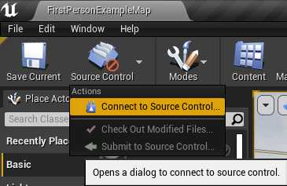
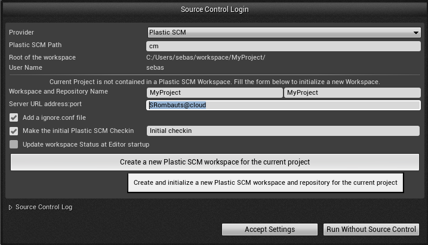
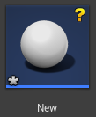
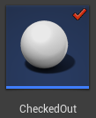
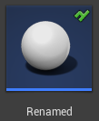
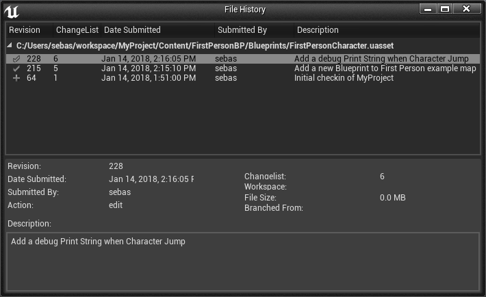
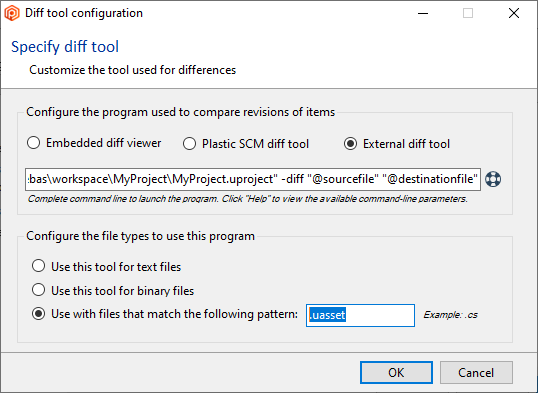

Unreal Engine Plastic SCM Source Control Plugin
-----------------------------------------------

This is the **official [Plastic SCM](https://www.plasticscm.com/) Source Control Plugin for Unreal Engine 4 & 5** (UE 4.11 to 4.27, and UE 5.0).
It has now been integrated in Unreal Engine and is shipping with it since UE4.24 (in a version equivalent to 1.4.6+). See the Status section bellow for more details

It is not intended to replace [Plastic SCM GUI](https://www.plasticscm.com/documentation/gui/plastic-scm-version-control-gui-guide.shtml) or [command line interface "cm"](https://www.plasticscm.com/documentation/cli/plastic-scm-version-control-cli-guide.shtml).
It is a complementary tool improving efficiency in your daily workflow with assets in Editor.

It automates tracking of assets, brings common SCM tasks inside the Editor, and provides visual diffing of Blueprints. It also helps importing an existing Unreal Project into source control, with appropriate *ignore.conf* file.
Since Unreal does not manage C++ source code, but only assets, the plugin is especially useful for GDs and artists.

## User Guide

### Plugin Setup

#### Unreal default version of the plugin

A version of this PlasticSCM plugin has now been integrated in Unreal Engine and is shipping with it since UE4.24.

Why: This is the easiest way to get started with Plastic SCM in Unreal Engine, but it will always be lagging behind the latest release here.

#### Manual installation from the latest version here

Why: if you want the latest features, performance improvements and bug fixes that are missing from Unreal integrated plugin.

1. Download the [latest binary release UE4PlasticPlugin-x.x.x.zip](https://github.com/SRombauts/UE4PlasticPlugin/releases) targeting your UE4 version.
2. Either:
    1. Unzip the content of the ZIP directly at the root of your project folder.
       This creates a "Plugins/UE4PlasticPlugin/" subdirectory into your project.
       This is the way to go to use Plastic SCM only on a specific project.
    2. Unzip the content of the ZIP in the Engine/ directory of UE4.x directly for all your projects
       (for instance "C:\Program Files\Epic Games\4.25\Engine\")
       This creates a "UE4PlasticPlugin" folder into the "Plugins/" subdirectory.
       This is the way to enable Plastic SCM for all Unreal Engine projects.
3. Then, launch you Unreal project, click on the Source Control icon "Connect to Source", select "Plastic SCM".

#### How to build from sources

Why: If your project is already a C++ project, you only have to re-generate Visual Studio project files (step 4 bellow) and the plugin will get rebuild the next time you compile your project.

Else, if you want to rebuild the plugin for a Blueprint project:

0. You need Visual Studio 2015 or 2017 with C++ language support (free Community Edition is fine).
1. Launch the Unreal Engine Editor, create a new C++ **Basic Code** Project (No Starter Content), for instance UnrealPlasticSCM. This should launch Visual Studio, build the game project, and open it into the Editor.
2. Close the Editor, then using the file explorer, create a new **Plugins** directory at the root of your project.
3. Clone the source code of the plugin into this _Plugins_ directory (for instance _Plugins\UE4PlasticPlugin_).
4. Right-click on your project's **.uproject** file, **Generate Visual Studio project files**.
5. In Visual Studio, **Reload All** and **Build Solution** in **Development Editor** mode. That's it, the plugin is built (resulting dlls are located in _Plugins\UE4PlasticPlugin\Binaries\Win64_).

To release the plugin, zip the _Plugins_ folder. But before that, remove the _Intermediate_, _Screenshots_ and _.git_ folders, and also the big *.pdb files in _Plugins\UE4PlasticPlugin\Binaries\Win64_.

### Project Setup

#### Enable Source Control

Launch you Unreal project, click on the Source Control icon "Connect to Source"

Then select "Plastic SCM" plugin

#### Create a new workspace & repository directly from Unreal

Source Control Login window, to create a new workspace/a new repository, click on "Initialize workspace" (exemple of a cloud repository):

Or on a server runing on localhost:

This creates an appropriate ignore.conf file, add all relevant files to source control (.uproject, Config & Content subdirectories)
and can also do the initial commit automatically at the end.

Wait for this to succeed before acception source control settings to not lock the UI & mess with the initialization!

### Status Icons

#### Source Control Menu

Source Control status tooltip, when hovering the Source Control icon in toolbar:

Source Control top Menu, extended with commands specific to Plastic SCM:

#### Source Control Windows

Submit Files to Source Control window, to check-in assets:

File History window, to see the changelog of an asset:

Visual Diffing of different revision of a Blueprint:

#### Redirectors

When Source Control is enabled Unreal creates a redirector whenever an asset is renamed or moved,
so that other developers relying on it's old name / location can still work with other assets referencing it.

This means, you end up with two files that you have to submit, even if by default they don't show up in the Content Browser.

You can show them in the Content Browser using a dedicated filter:

You can also delete them recursively using the context menu "Fix Up Redirectors in Folder":

#### Worfklow

Unreal Engine workflow with binary assets works best with mostly only one branch (regardless of the source control used).

- TODO: list limitations working with branches, and possible workflow
- TODO: describe how to use Gluon to enable working without always getting latest version before a submit

### Plastic SCM Setup

#### Locking UE4 assets

[Administrator guide - Chapter 7: Configuring exclusive checkout (Lock)](https://www.plasticscm.com/documentation/administration/plastic-scm-version-control-administrator-guide#Chapter7:Configuringexclusivecheckout(Lock))

Binary assets should be locked for exclusive access to avoid merge conflicts.

To lock all assets on the whole `Content` directory, you need to put a `lock.conf` in your server directory (for instance `C:\Program Files\PlasticSCM5\server`) with this content:

    rep:reponame lockserver:servername:8084
    /Content

For instance:

    rep:UE4PlasticPluginDev lockserver:localhost:8087
    /Content

or:

    rep:UE4PlasticPluginDev lockserver:localhost:8087
    *.uasset
    *.umap

On Plastic Cloud, you can just setup lock rules like that:

    /Content

#### Visual Diff of Blueprint from Plastic SCM GUI

In "Preferences -> Diff tools" add a new config for uasset and move it up **before** the existing `$binary` one:

The command line needs the quoted path to the UE4Editor.exe, the quoted patch to your ".uproject" file, -diff, thant the source & destination files variables also quoted

    "C:\Program Files\Epic Games\UE_4.25\Engine\Binaries\Win64\UE4Editor.exe" "C:\wkspaces\MyProject\MyProject.uproject" -diff "@sourcefile" "@destinationfile"

### Unreal Documentation

- [Source Control user interface](https://docs.unrealengine.com/latest/INT/Engine/UI/SourceControl/)
- [Source Control Inside Unreal Editor](https://docs.unrealengine.com/latest/INT/Engine/Basics/SourceControl/InEditor/)

- [Diffing Unreal Assets](https://www.unrealengine.com/blog/diffing-unreal-assets)
- [Diffing Blueprints (Video)](https://www.unrealengine.com/blog/diffing-blueprints)

### Status

This version here is the development version, so it can contain additional fixes, performance improvements or new features.

#### Version 1.4.11 2022/03/29 for UE4.27.2:
- manage connection to the server
- show current branch name and CL in status text
- display status icons to show controlled/checked-out/added/deleted/private/changed/ignored/not-up-to-date files
- display locked files, and by who
- add, duplicate a file
- move/rename a file or a folder
- revert modifications of a file (works best with the "Content Hot-Reload" option since UE4.15)
- check-in a set of files with a multi-line UTF-8 comment
- migrate (copy) an asset between two projects if both are using Plastic SCM
- delete file (but no way to check-in them, see known issues bellow)
- update workspace to latest head (Sync command)
- show history of a file
- visual diff of a blueprint against depot or between previous versions of a file
- initialize a new workspace to manage your UE4 Game Project.
- make the initial commit with a custom message
- create an appropriate ignore.conf file as part of initialization
- also permit late creation of the ignore.conf file
- show conflicted files and 3-way visual diff
- solve a merge conflict on a blueprint
- top-menu global "Sync" instead of on folder's context menu
- top-menu global "undo unchanged" and "undo all checkout"
- [Partial Checkin (like Gluon, for artists)](http://blog.plasticscm.com/2015/03/plastic-gluon-is-out-version-control.html)
- Plastic Cloud is fully supported
- xlinks sub-repositories (for Plugins for instance)
- support legacy status command from PlasticSCM version 8.0.16.3000 (crash fix)
- Windows only

#### Feature Requests
- Unreal Engine 5.0 full support
  - One File Per Actor
  - Changelists
- Branches support, to check outdated files vs. remote across multiple branches
- Mac OS X Support
- add a setting to pass the --update option to "checkin"
- add a setting to tell UE if Plastic SCM is configured to use "read-only flags" like Perforce
- add a "clean directory" or "check-in deleted files"
- add dedicated icon for Changed files
- add dedicated icon for Conflicted files
- add dedicated icon for Replaced/Merged files

#### Known issues
- Merge conflict from cherry-pick or from range-merge cannot be solved by the plugin: use the Plastic SCM GUI
- Merge Conflict: "Accept Target" crash the UE4.11 Editor (same with Git Plugin)
- #18 Error messages with accents are not correctly handled/displayed (for instance connection error in French)
- the Editor does not handle visual diff for renamed/moved assets
- History does not show which revision is the current/checkout one
- Editing an asset that is "Changed" but not checked-out pop up a "Files need check-out!" (UnrealEdSrv.cpp) that does nothing when clicked!
- the Editor does not show folder status and is not able to manage them
- Branch and Merge are not in the current Editor workflow

#### Features reserved for internal use by Epic Games with Perforce only
- tags: get labels (used for crash when the full Engine is under Plastic SCM)
- annotate: blame (used for crash when the full Engine is under Plastic SCM)

### Support

You can always ask for support in:
- [Plastic SCM support](https://www.plasticscm.com/support)
- [Plastic SCM forums](https://forum.plasticscm.com/)
- [Unreal Engine forums](https://forums.unrealengine.com/)
- [Unreal Slackers Discord community](https://discord.gg/unreal-slackers)

#### Enable logging for Plastic SCM ==

To help diagnose any issue related to the underlying Plastic SCM "cm" Command Line Interface,
[enable logging for Plastic SCM](https://www.plasticscm.com/documentation/technical-articles/kb-enabling-logging-for-plastic-scm-part-i).

#### Report an issue

To report an issue, please use the [Github issue-tracker](https://github.com/SRombauts/UE4PlasticPlugin/issues?q=is%3Aissue).

1. Have a look at existing issues (Open and Closed ones)
2. Specify your Engine & Plugin versions, and if either are built from sources
3. Describe precisely your issue
4. Add reproduction steps, if possible on a basic template project
5. Post a Log file when applicable (or the corresponding redacted section)
   1. [enable **UTC Timestamp** in Logs: menu _Preferences -> General -> Appearance -> Log Timestamp Mode_](https://answers.unrealengine.com/questions/358370/time-stamps-in-output-log.html)
   2. Grab the file **ProjectName/Saved/Logs/ProjectName.log**

#### Use merge requests

If you want to help, [Github Pull Requests](https://github.com/SRombauts/UE4PlasticPlugin/pulls) are welcome!

### Copyright

Copyright (c) 2016-2020 Codice Software
Developped by Sébastien Rombauts (sebastien.rombauts@gmail.com)

